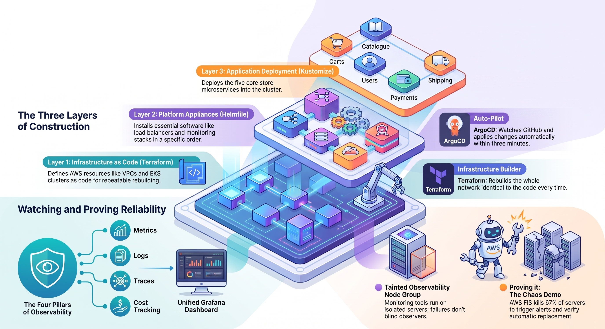

# SCTP CE12 Group 5 Capstone Project

Sandbox repository for the CE12 DevOps Capstone project — a hands-on exploration of how modern teams provision infrastructure, deploy applications, and keep them running in practice.

## The Team

- SK (Team Lead)
- Arista
- Gina
- Indy
- ƒαιzαℓ.

---

## What We Built

This is a **learning project** that explores how modern DevOps teams operate in practice. We deployed a sample retail store application onto AWS and built the surrounding platform — the infrastructure, automation, and observability tooling — from scratch.

The application itself (a fictional online store with five services: catalogue, cart, checkout, orders, and UI) is a stand-in. The real focus was on the platform around it: how to provision infrastructure reliably, deploy changes safely, know when something breaks, and understand what it costs to run.

We used the same categories of tools that engineering teams at real companies use. This is not a production system — it has no TLS, no CI pipeline, no multi-environment setup, and the app images are pre-built rather than owned by us. But it gave us hands-on experience with each layer of a real deployment pipeline.

### What Each Tool Does

| What it does | Tool used |
|---|---|
| Provision cloud servers and networking | Terraform |
| Run and manage containerised services | Amazon EKS (Kubernetes) |
| Deploy changes automatically from Git | ArgoCD |
| Monitor system health and performance | Prometheus + Grafana |
| Trace requests across services | AWS X-Ray + OpenTelemetry |
| Collect and search application logs | Fluent Bit + Loki |
| Send alerts when something breaks | Alertmanager → Discord |
| Track cloud spending | Kubecost |
| Automatically manage DNS records | ExternalDNS |
| Simulate server failures to test resilience | AWS Fault Injection Service |

### How a Change Gets Deployed

```
Developer pushes code to GitHub
        ↓
ArgoCD detects the change (within ~3 minutes)
        ↓
ArgoCD applies it to the cluster automatically
        ↓
Prometheus checks that everything is still healthy
        ↓
If something breaks → Alertmanager sends a Discord alert
```

This is a platform exercise, not a production system or an app we own the code for — see
[Known Limitations](#known-limitations) for the full list of what's intentionally out of scope.

---

## Live URLs

| Service | URL |
|---|---|
| Retail Store | http://grp5.sctp-sandbox.com |
| Grafana (dashboards) | http://grp5-grafana.sctp-sandbox.com |
| ArgoCD (deployments) | http://grp5-argocd.sctp-sandbox.com |
| Kubecost (cloud spend) | http://grp5-kubecost.sctp-sandbox.com |
| Prometheus (metrics) | http://grp5-prometheus.sctp-sandbox.com |

---

## Design Decisions

Each major tool choice in this project is documented as an Architecture Decision Record (ADR) in [`docs/adr/`](docs/adr/). These explain what we chose, what we considered, and why.

| ADR | Decision |
|---|---|
| [0001](docs/adr/0001-compute-platform.md) | Why Amazon EKS for compute |
| [0002](docs/adr/0002-gateway-api-vs-ingress.md) | Gateway API instead of classic Ingress |
| [0003](docs/adr/0003-helmfile-kustomize-split.md) | Splitting Helmfile (platform) and Kustomize (app) |
| [0004](docs/adr/0004-observability-stack.md) | Prometheus, Grafana, Loki, and OpenTelemetry for observability |
| [0005](docs/adr/0005-dedicated-observability-node-group.md) | Dedicated tainted node group for observability workloads |
| [0006](docs/adr/0006-terraform-remote-state-s3.md) | S3 remote state with native locking for Terraform |
| [0007](docs/adr/0007-kubecost-for-cost-visibility.md) | Kubecost for cost visibility |
| [0008](docs/adr/0008-aws-fis-for-chaos-engineering.md) | AWS FIS for chaos and failure-injection testing |
| [0009](docs/adr/0009-argocd-gitops.md) | ArgoCD for GitOps continuous delivery of the application layer |
| [0010](docs/adr/0010-otel-auto-instrumentation.md) | OpenTelemetry Operator injection for distributed tracing |
| [0011](docs/adr/0011-discord-alertmanager.md) | Discord for Alertmanager notifications |

---

## Known Limitations

This is a **learning project, not a production system** — no HTTPS, no secrets manager, no hardened
security posture. The rest of this list is what we deliberately left out of scope, either because it
needed more time/infrastructure than we had, or because it's not the point of the exercise (the platform,
not the application).

- **No HTTPS** — all services are plain HTTP; a real system would use TLS with ACM or cert-manager
- **No CI pipeline** — there is no automated image building, unit testing, or vulnerability scanning; we deploy pre-built images from the [AWS EKS Workshop](https://www.eksworkshop.com/docs/introduction/getting-started/about) reference app as-is
- **Not owned application code** — we do not control what is inside the container images; this project is about the platform, not the application
- **No secrets manager** — sensitive values like the Discord webhook URL are stored as plain Kubernetes Secrets, not in AWS Secrets Manager or Vault
- **Known issue — DB passwords committed in git**: `manifests/catalog/secrets.yaml` and
  `manifests/orders/secrets.yaml` contain the `catalog-db`/`orders-db` passwords as base64-encoded
  Kubernetes Secret manifests. Base64 is encoding, not encryption — anyone with repo access can decode
  them (`echo '<value>' | base64 -d`). This was a lower-severity oversight while the repo was private;
  now that it's public, treat both values as already exposed. Not yet rotated — tracked here as a known
  issue rather than fixed silently.
- **No multi-environment** — one cluster, one environment; a real setup would separate dev, staging, and production with promotion gates between them
- **No auto-scaling** — Horizontal Pod Autoscaler and Cluster Autoscaler are not configured
- **No RBAC** — all team members have cluster-admin access; a real system would scope permissions by role
- **No network policies** — services can communicate freely within the cluster with no restrictions
- **Single region** — no cross-region redundancy or disaster recovery
- **Not designed to be forked as-is** — S3 bucket names, the EKS cluster name, the pinned EBS volume IDs,
  and a hardcoded AWS Account ID in a few manifests (see [`docs/installation.md`](docs/installation.md))
  are all specific to this shared training AWS account. Running this in your own account means creating
  your own equivalents of each, not reusing the values checked into this repo.

**A note on repo visibility:** this repository has switched between public and private more than once and
may again. Treat anything ever committed here as permanently public — toggling GitHub's visibility
setting does not erase git history, existing forks, or caches that already pulled it. Don't rely on "the
repo is private right now" as a reason to commit a real secret, even temporarily; the DB password issue
above is exactly what that assumption leads to.

---

## Architecture Overview



This repo deploys a sample retail-store application (five microservices: `carts`, `catalog`, `checkout`,
`orders`, `ui`) onto Amazon EKS, along with a full observability stack (Prometheus, Grafana, Loki,
OpenTelemetry, Kubecost) and supporting AWS infra (VPC, IAM roles, load balancer, DNS).

Deployment happens in three layers, always in this order:

1. **Terraform** (`terraform/`) — creates the VPC, EKS cluster, node groups, and IAM roles.
2. **Helmfile** (`helm/`) — installs cluster controllers and platform services (load balancer controller,
   external-dns, Prometheus stack, Loki, OpenTelemetry operator, Kubecost).
3. **Kustomize** (`manifests/`) — deploys the application microservices and alerting rules.

After the first apply, [ArgoCD](#argocd-repo-credential-set-up-before-the-kustomize-apply-below) takes over syncing the app layer
(`manifests/`) automatically on every commit to `main` — Terraform and Helmfile still need to be run
manually as above.

For details on what each Helm release/CRD is responsible for, see
[`docs/installation.md`](docs/installation.md). For the metrics each service exposes and example Grafana
queries, see [`docs/app_metrics.md`](docs/app_metrics.md).

---

## Prerequisites

Install and configure these tools before starting:

| Tool | Purpose | Used version |
|---|---|---|
| [AWS CLI](https://docs.aws.amazon.com/cli/latest/userguide/getting-started-install.html) | AWS access, run `aws configure` first | any recent v2 |
| [Terraform](https://developer.hashicorp.com/terraform/install) | Provision VPC/EKS/IAM | v1.15+ |
| [kubectl](https://kubernetes.io/docs/tasks/tools/) | Talk to the cluster | v1.36+ |
| [Helmfile](https://github.com/helmfile/helmfile#installation) | Install Helm charts declaratively | v1.5+ |
| [Helm](https://helm.sh/docs/intro/install/) | Used internally by Helmfile | any recent v3 |
| [GitHub CLI (`gh`)](https://cli.github.com/) | Register the ArgoCD repo deploy key | any recent |
| `envsubst` (part of `gettext`) | Substitute env vars into templated YAML | any |
| `jq` | Parse JSON output in the DEMO section | any |

You also need AWS credentials with permission to create the resources above, and to be listed in
`cluster_admins` in [`terraform/variables.tf`](terraform/variables.tf) if you want `kubectl` admin access
to the cluster.

## Project Structure

```text
ce12-capstone-sandbox/
├── docs/
│   ├── adr/                          # Architecture Decision Records — why each tool was chosen
│   ├── diagrams/                     # Architecture diagram source files (.drawio)
│   ├── images/
│   ├── app_metrics.md                # Per-service metrics reference and example Grafana queries
│   ├── installation.md               # CRD ownership and Helmfile/Kustomize split details
│   ├── platform-field-guide.html     # Plain-English platform walkthrough (HTML)
│   ├── platform-field-guide.pdf      # Same walkthrough, PDF
│   └── presentation-outline.md       # Demo run-through script for presentations
├── helm/
│   ├── crds/
│   ├── values/
│   ├── ebs-volumes.env
│   ├── helmfile.yaml.gotmpl
│   └── retained-storage.yaml
├── manifests/
│   ├── adot/
│   ├── alerts/
│   ├── argocd/
│   ├── carts/
│   ├── catalog/
│   ├── checkout/
│   ├── fluentbit/
│   ├── grafana/
│   ├── kubecost/
│   ├── load-gen/
│   ├── orders/
│   ├── otel-instrumentation/
│   ├── ui/
│   └── kustomization.yaml
├── terraform/
│   ├── eks.tf
│   ├── iam.tf
│   ├── main.tf
│   ├── providers.tf
│   ├── variables.tf
│   └── vpc.tf
├── .gitignore
└── README.md
```

---

## Setup

These steps only need to be run once per environment, before the first `terraform apply`.

### 1. Create the S3 buckets

Terraform's state and Loki's log chunks both live in S3 and must exist _before_ you run Terraform.

```bash
# Bucket for Terraform remote state (matches terraform/providers.tf backend config)
aws s3api create-bucket \
  --bucket capstone-project-group5 \
  --region ap-southeast-1 \
  --create-bucket-configuration LocationConstraint=ap-southeast-1

# Bucket for Loki chunk/index storage (matches terraform/variables.tf loki_bucket_name
# and helm/values/loki.yaml bucketNames)
aws s3api create-bucket \
  --bucket retail-store-grp5-loki-chunks \
  --region ap-southeast-1 \
  --create-bucket-configuration LocationConstraint=ap-southeast-1
```

### 2. Create the retained EBS volumes

Grafana, Prometheus, Loki, Alertmanager, and Kubecost each get a "retained" EBS volume so their data
survives a `helmfile destroy`/`sync` cycle (see [`helm/retained-storage.yaml`](helm/retained-storage.yaml)).
Create one volume per service, all in the same AZ used by the `observability` node group
(`ap-southeast-1c`, see [`terraform/eks.tf`](terraform/eks.tf)):

```bash
aws ec2 create-volume --region ap-southeast-1 --availability-zone ap-southeast-1c --size 20 --volume-type gp3 --tag-specifications 'ResourceType=volume,Tags=[{Key=Name,Value=retail-store-grp5-prometheus-retained}]'
aws ec2 create-volume --region ap-southeast-1 --availability-zone ap-southeast-1c --size 20 --volume-type gp3 --tag-specifications 'ResourceType=volume,Tags=[{Key=Name,Value=retail-store-grp5-loki-retained}]'
aws ec2 create-volume --region ap-southeast-1 --availability-zone ap-southeast-1c --size 10 --volume-type gp3 --tag-specifications 'ResourceType=volume,Tags=[{Key=Name,Value=retail-store-grp5-grafana-retained}]'
aws ec2 create-volume --region ap-southeast-1 --availability-zone ap-southeast-1c --size 10 --volume-type gp3 --tag-specifications 'ResourceType=volume,Tags=[{Key=Name,Value=retail-store-grp5-alertmanager-retained}]'
aws ec2 create-volume --region ap-southeast-1 --availability-zone ap-southeast-1c --size 20 --volume-type gp3 --tag-specifications 'ResourceType=volume,Tags=[{Key=Name,Value=retail-store-grp5-kubecost-retained}]'
```

These volumes are created once and then reused on every future `helmfile sync` — you don't need to
recreate them unless they're deleted. Their IDs are pinned as fixed values in the "Helm Chart
installation" step below (see that section for why tag-based lookup isn't used).

---

## Startup

### Provision VPC, EKS Cluster

```bash
terraform -chdir=terraform init
terraform -chdir=terraform apply
```

### Helm Chart Installation

First point `kubectl`/`helm` at the new cluster and export the account/VPC IDs the chart values need:

```bash
aws eks --region ap-southeast-1 update-kubeconfig --name retail-store-grp5
export AWS_ACCOUNT_ID=$(aws sts get-caller-identity --query Account --output text)
export VPC_ID=$(aws eks describe-cluster --name retail-store-grp5 --region ap-southeast-1 --query 'cluster.resourcesVpcConfig.vpcId' --output text)
```

Next, check the volume IDs are still valid, then source them (this account has a periodic cleanup
process that can delete these unmanaged volumes without warning):

```bash
aws ec2 describe-volumes --region ap-southeast-1 \
  --volume-ids $(grep -oE 'vol-[a-z0-9]+' helm/ebs-volumes.env) \
  --query 'Volumes[].{Id:VolumeId,State:State}' --output table
```

- All 5 show a `State` → continue below.
- Any `InvalidVolume.NotFound` (never created, or swept by the cleanup process) → **stop**, don't run
  `helmfile sync` yet. Create them via
  [Troubleshooting → EBS volumes were deleted](#ebs-volumes-were-deleted), then re-run this check.

```bash
source helm/ebs-volumes.env
```

(Pinned IDs rather than a `Name`-tag lookup, because the tag isn't unique in EC2 — a recreated volume
keeps the old tag, so a tag-based lookup can silently grab the wrong duplicate.)

Then sync the Helm releases:

```bash
helmfile -f helm/helmfile.yaml.gotmpl lint #optional
helmfile -f helm/helmfile.yaml.gotmpl sync
```

Validation:

```bash
helmfile -f helm/helmfile.yaml.gotmpl list
kubectl get pods -n kube-system  # shows aws-load-balancer-controller healthy.
kubectl get pods -n external-dns # shows external-dns healthy.
kubectl get pods -n monitoring   # shows prometheus/grafana healthy.

kubectl get pv retained-grafana-pv retained-prometheus-tsdb-pv retained-loki-data-pv retained-alertmanager-data-pv retained-kubecost-local-store-pv
kubectl get pvc -n monitoring
kubectl get pvc -n kubecost
kubectl get pods -n monitoring
kubectl get pods -n kubecost

kubectl get pod -n monitoring -l app.kubernetes.io/name=grafana -o jsonpath='{.items[0].spec.volumes}'
kubectl get pod -n monitoring -l app.kubernetes.io/name=prometheus -o jsonpath='{.items[0].spec.volumes}'
kubectl get pod -n monitoring -l app.kubernetes.io/name=loki -o jsonpath='{.items[0].spec.volumes}'
```

### ArgoCD Repo Credential (set up before the Kustomize apply below)

This repo's visibility has changed before and may again (see [Known Limitations](#known-limitations)).
Set up a read-only deploy key for ArgoCD regardless of whether the repo is currently public or private —
it's harmless when public, required when private, and doing it up front means ArgoCD sync doesn't
silently break the next time visibility flips. Generate a deploy key and register it as an ArgoCD
repository credential **before** running the Kustomize apply below — that way ArgoCD can sync immediately
once its bootstrap `Application` is created, instead of sitting in a transient "repository not
found"/auth error until the credential shows up. This only needs to be done once per environment (i.e.
again after a fresh `terraform apply`, since the Secret lives inside the cluster and doesn't survive a
`terraform destroy`):

```bash
ssh-keygen -t ed25519 -C "argocd-ce12-capstone-sandbox-readonly" -f argocd_deploy_key -N ""
gh repo deploy-key add argocd_deploy_key.pub --repo mfaizalbe/ce12-capstone-sandbox --title "argocd-readonly"

kubectl create secret generic repo-ce12-capstone-sandbox \
  -n argocd \
  --from-literal=type=git \
  --from-literal=url=git@github.com:mfaizalbe/ce12-capstone-sandbox.git \
  --from-file=sshPrivateKey=argocd_deploy_key
kubectl label secret repo-ce12-capstone-sandbox -n argocd argocd.argoproj.io/secret-type=repository

rm argocd_deploy_key argocd_deploy_key.pub  # private key only ever lives in the k8s Secret, never in git
```

### Discord Webhook Secret (also set up before the Kustomize apply below)

A separate, unrelated secret — Alertmanager needs this to send the `NodeNotReady`/`RetailStorePodsPending`
alerts to Discord (see [What Happens When Something Breaks](#what-happens-when-something-breaks)):

```bash
kubectl -n monitoring create secret generic discord-webhook \
  --from-literal=url='https://discord.com/api/webhooks/<id>/<token>' \
  --dry-run=client -o yaml | kubectl apply -f -
```

### Start Application with Kustomize

```bash
aws eks --region ap-southeast-1 update-kubeconfig --name retail-store-grp5
export AWS_ACCOUNT_ID=$(aws sts get-caller-identity --query Account --output text)
export AWS_REGION=ap-southeast-1
export EKS_CLUSTER_NAME=retail-store-grp5
kubectl kustomize manifests | envsubst '${AWS_ACCOUNT_ID} ${EKS_CLUSTER_NAME} ${AWS_REGION}' | kubectl apply -f -
```

Validation:

```bash
kubectl get all -A
kubectl get application -n argocd retail-store   # should show Synced/Healthy
```

This command also creates the ArgoCD `Application` (`manifests/argocd/application.yaml`), which then
takes over: future commits to `manifests/` on `main` are synced automatically — ArgoCD deletes anything
removed from git (`prune`) and reverts anything changed out-of-band back to match git (`selfHeal`) — so
you don't need to re-run this command for app changes going forward. It's still needed for the very first
apply, and works as a manual fallback any time.

---

## Shutdown

Tear everything down in the reverse order it was created (application first, then platform, then infra):

```bash
kubectl delete -k manifests
helmfile -f helm/helmfile.yaml.gotmpl destroy
terraform -chdir=terraform destroy
```

This does **not** delete the S3 buckets or retained EBS volumes from [Setup](#setup) — they're designed
to survive a teardown so dashboards/data/state persist across rebuilds. Delete them manually only if you
want to fully decommission the environment.

---

## Troubleshooting

Recovery steps for this shared, multi-team AWS account. Root cause in most cases: an instructor cleanup
script (or an interrupted `apply`) changed AWS resources without Terraform's state file finding out.

### First things to check after a suspected nuke

```bash
kubectl get nodes                       # 0 nodes = EKS node groups are gone
terraform -chdir=terraform plan         # should show "No changes" if nothing was touched
aws eks list-nodegroups --cluster-name retail-store-grp5 --region ap-southeast-1
```

`terraform plan` wanting to add dozens of resources that should already exist, or `kubectl get nodes`
returning nothing, means **drift**: AWS and Terraform's state file disagree about what exists. Go to the
matching section below instead of immediately re-running `terraform apply` — a plain re-apply fails loudly
on resources that already exist in AWS but aren't in state.

### `terraform apply` fails with `EntityAlreadyExists` / `AlreadyExistsException`

**What it means:** the resource exists in AWS but Terraform's state doesn't know about it — a previous
`apply` was interrupted before the state file caught up, or a nuke tool deleted some resources but not
others.

**Do not delete-and-recreate.** That risks breaking IAM trust relationships or repointing the KMS key that
encrypts cluster secrets. Reconcile state instead:

1. For each conflicting resource in the error output, note its Terraform address (e.g.
   `aws_iam_role.fluent_bit_irsa`) and real-world ID/ARN — the error gives you the name; for policies, look
   up the ARN with `aws iam list-policies --scope Local --query "Policies[?PolicyName=='<name>']"`.
2. Write an `import` block for each one in a scratch `.tf` file:
   ```hcl
   import {
     to = aws_iam_role.fluent_bit_irsa
     id = "retail-store-grp5-fluent-bit-irsa"
   }
   ```
   Use `import` blocks + `terraform plan`/`apply`, not the legacy `terraform import` CLI command — the CLI
   command can fail with a spurious `Invalid count argument` error on this repo's module structure, even
   though a plain `plan`/`apply` handles the same resources fine.
3. `terraform plan` should show `N to import, M to add, K to change, 0 to destroy`. Zero destroys = safe
   to proceed. Anything under "will be destroyed" → stop and investigate first.
4. `terraform apply`, then delete the scratch import file (one-shot, not meant to stay in the codebase).

KMS alias (`alias/eks/retail-store-grp5`) among the conflicts, with a `target_key_id` that doesn't match
the key already in state? Check which key the running cluster actually uses before importing:

```bash
aws eks describe-cluster --name retail-store-grp5 --region ap-southeast-1 \
  --query 'cluster.encryptionConfig[0].provider.keyArn'
```

Matches the key already in state → importing and repointing the alias is safe.

### `helmfile sync` fails with pods stuck `Pending`, or `another operation (install/upgrade/rollback) is in progress`

**What it means:** zero nodes, almost always. Check `kubectl get nodes` — empty means the node groups never
got created (previous section). Every controller/operator pod sits `Pending` forever with nowhere to
schedule, and any release whose upgrade hook depends on a pod running (like ArgoCD's
`argocd-redis-secret-init` Job) gets stuck mid-upgrade and locks itself.

Fix the node group problem, wait for `kubectl get nodes` to show `Ready`, retry `helmfile sync`. Most
releases succeed on their own once nodes exist.

### A specific Helm release is still stuck on "another operation ... is in progress" after nodes are up

**What it means:** an orphaned lock, not a real in-progress operation. The release's Helm history is stuck
on a `pending-upgrade`/`pending-install` revision whose Kubernetes resources are long gone — confirm with
`kubectl get pods,jobs -n <namespace>` (empty = nothing left for it to finish).

```bash
helm history <release> -n <namespace>                                    # find the stuck revision number
kubectl delete secret sh.helm.release.v1.<release>.v<N> -n <namespace>   # N = the stuck revision
helmfile -f helm/helmfile.yaml.gotmpl sync --selector name=<release>
```

Only do this after confirming via `kubectl get pods,jobs` that nothing is actually mid-install — deleting
the record while a real operation is running loses Helm's track of it.

### EBS volumes were deleted

**What it means:** the pinned IDs in [`helm/ebs-volumes.env`](helm/ebs-volumes.env) no longer exist —
caught by the verification command in [Helm Chart Installation](#helm-chart-installation). This account's
cleanup process isn't scoped to Terraform, so these unmanaged EC2 volumes can be swept even when the rest
of the environment survives.

No way to recover the old data once a volume is actually deleted — "retained" storage protects against
`helmfile destroy`/`sync` cycles, not against the volume itself being deleted. Recreate fresh ones:

```bash
aws ec2 create-volume --region ap-southeast-1 --availability-zone ap-southeast-1c --size 20 --volume-type gp3 --tag-specifications 'ResourceType=volume,Tags=[{Key=Name,Value=retail-store-grp5-prometheus-retained}]'
aws ec2 create-volume --region ap-southeast-1 --availability-zone ap-southeast-1c --size 20 --volume-type gp3 --tag-specifications 'ResourceType=volume,Tags=[{Key=Name,Value=retail-store-grp5-loki-retained}]'
aws ec2 create-volume --region ap-southeast-1 --availability-zone ap-southeast-1c --size 10 --volume-type gp3 --tag-specifications 'ResourceType=volume,Tags=[{Key=Name,Value=retail-store-grp5-grafana-retained}]'
aws ec2 create-volume --region ap-southeast-1 --availability-zone ap-southeast-1c --size 10 --volume-type gp3 --tag-specifications 'ResourceType=volume,Tags=[{Key=Name,Value=retail-store-grp5-alertmanager-retained}]'
aws ec2 create-volume --region ap-southeast-1 --availability-zone ap-southeast-1c --size 20 --volume-type gp3 --tag-specifications 'ResourceType=volume,Tags=[{Key=Name,Value=retail-store-grp5-kubecost-retained}]'
```

Then update every ID in `helm/ebs-volumes.env` to match:

```bash
aws ec2 describe-volumes --region ap-southeast-1 \
  --filters "Name=tag:Name,Values=retail-store-grp5-*-retained" \
  --query 'Volumes[].{Id:VolumeId,Name:Tags[?Key==`Name`]|[0].Value}' --output table
```

Commit the updated file, then re-run the verification command from
[Helm Chart Installation](#helm-chart-installation) to confirm before continuing.

---

## Useful Commands

If you're running these in a fresh terminal/session, point kubectl at the cluster first:

```bash
aws eks --region ap-southeast-1 update-kubeconfig --name retail-store-grp5
```

### Get Grafana Admin Password

```bash
kubectl get secret -n monitoring prometheus-grafana -o jsonpath="{.data.admin-password}" | base64 --decode
```

### Get ArgoCD Admin Password

Username is `admin`.

```bash
kubectl get secret -n argocd argocd-initial-admin-secret -o jsonpath="{.data.password}" | base64 --decode
```

---

## What Happens When Something Breaks

We set up two alerts to fire during the node failure demo below. Here is what each one means and what happens when it triggers.

### NodeNotReady (severity: critical)

**What triggers it:** A cluster node (virtual server) has not reported itself as healthy for more than 15 seconds — usually because it was terminated or crashed.

**What you see:**
- The Grafana dashboard panel turns red with "FIRING!"
- Alertmanager sends a message to the team Discord channel

**What happens next:** Because we use an EKS managed node group, AWS automatically detects the failed node and launches a replacement. The cluster reschedules the affected pods onto healthy nodes. Within a few minutes everything is green again — no manual action needed.

### RetailStorePodsPending (severity: warning)

**What triggers it:** One or more application pods have been stuck waiting to start for more than 5 seconds. This is the expected knock-on effect of a node failure — Kubernetes evicts pods from the dead node and has to find somewhere else to run them.

**What you see:**
- The Grafana dashboard panel turns red with "FIRING!"
- A second Discord message arrives indicating which namespace is affected

**What happens next:** Once the replacement node is ready and joins the cluster, the pending pods are scheduled onto it and start running. This alert typically resolves itself a minute or two after NodeNotReady clears.

Both alerts are defined in [`manifests/alerts/prometheusrule.yaml`](manifests/alerts/prometheusrule.yaml). You can trigger them deliberately using the node failure demo right below.

---

## DEMO: Node Failure Simulation

This uses [AWS Fault Injection Service (FIS)](https://docs.aws.amazon.com/fis/) to terminate 67% of the
instances in the `application` node group on purpose, so you can watch the cluster self-heal and see the
`NodeNotReady`/`RetailStorePodsPending` Prometheus alerts fire
(see [`manifests/alerts/prometheusrule.yaml`](manifests/alerts/prometheusrule.yaml)). The IAM role FIS
assumes is created by Terraform (`fis_role` in [`terraform/iam.tf`](terraform/iam.tf)).

### Configure Environment Variables

```bash
export AWS_ACCOUNT_ID=$(aws sts get-caller-identity --query Account --output text)
export AWS_REGION="ap-southeast-1"
export FIS_ROLE_ARN="arn:aws:iam::${AWS_ACCOUNT_ID}:role/retail-store-grp5-fis-role"
export CLUSTER_NAME="retail-store-grp5"

export NODEGROUP_NAME=$(aws eks list-nodegroups \
  --region "$AWS_REGION" \
  --cluster-name "$CLUSTER_NAME" \
  --query "nodegroups[?starts_with(@, '${CLUSTER_NAME}-ng-application')]" \
  --output text)

export NODEGROUP_ARN=$(aws eks describe-nodegroup \
  --region "$AWS_REGION" \
  --cluster-name "$CLUSTER_NAME" \
  --nodegroup-name "$NODEGROUP_NAME" \
  --query "nodegroup.nodegroupArn" \
  --output text)
```

### Recreate the Experiment Template

**Always recreate the experiment template before running this demo.** AWS FIS experiment templates store the EKS managed node group ARN. Whenever the cluster is recreated (e.g. after a Terraform destroy/apply), the ARN changes and reusing an old template will fail with `InvalidTarget: The following targeted node groups do not exist.`

List and delete any existing NodeDeletion templates:

```bash
aws fis list-experiment-templates \
  --region "$AWS_REGION" \
  --output table
```

```bash
aws fis delete-experiment-template \
  --id <EXPERIMENT_TEMPLATE_ID> \
  --region "$AWS_REGION"
```

Repeat for each NodeDeletion template returned. Then create a new one:

```bash
export NODE_EXP_ID=$(aws fis create-experiment-template \
  --region "$AWS_REGION" \
  --cli-input-json '{
    "description":"NodeDeletion",
    "targets":{
      "target-nodegroup":{
        "resourceType":"aws:eks:nodegroup",
        "resourceArns":["'"$NODEGROUP_ARN"'"],
        "selectionMode":"ALL"
      }
    },
    "actions":{
      "nodedeletion":{
        "actionId":"aws:eks:terminate-nodegroup-instances",
        "parameters":{
          "instanceTerminationPercentage":"67"
        },
        "targets":{
          "Nodegroups":"target-nodegroup"
        }
      }
    },
    "stopConditions":[
      {
        "source":"none"
      }
    ],
    "roleArn":"'"$FIS_ROLE_ARN"'",
    "tags":{
      "ExperimentSuffix":"DEMO"
    }
  }' \
  --output json | jq -r '.experimentTemplate.id')
```

Verify that the template was created successfully:

```bash
echo "$NODE_EXP_ID"
```

### Run the Experiment

```bash
aws fis start-experiment \
  --region "$AWS_REGION" \
  --experiment-template-id "$NODE_EXP_ID"
```

### Cleanup

Delete the template immediately after starting the experiment — `$NODE_EXP_ID` is still set in this terminal and deleting the template does not affect the running experiment:

```bash
aws fis delete-experiment-template \
  --id "$NODE_EXP_ID" \
  --region "$AWS_REGION"
```

### Monitor the Cluster

Open separate terminals and monitor the cluster while the experiment is running.

Watch Grafana: [Node Failure Demo dashboard](http://grp5-grafana.sctp-sandbox.com/d/retail-store-node-failure-demo/)

Watch node status:

```bash
watch kubectl get nodes
```

Watch all pods:

```bash
watch kubectl get pods -A
```

### Expected Behaviour

During the experiment you should observe the following sequence:

1. AWS FIS terminates approximately 67% of the application node group instances.
2. One or more application nodes transition to NotReady.
3. Amazon EKS automatically launches replacement EC2 instances and new worker nodes join the cluster.
4. Kubernetes reschedules affected application pods onto the replacement nodes.
5. Prometheus alerts `NodeNotReady` and `RetailStorePodsPending` fire during the disruption.
6. Once replacement nodes become Ready and workloads recover, the alerts automatically clear.

This demonstrates the cluster's self-healing capability under node failure conditions.


### Presentation Slides

Slides: [Deploying and Operating a Retail Platform on AWS EKS: An SRE & DevOps Journey](https://docs.google.com/presentation/d/1Q8uqIPG0ueoZPHuFo-w3-zNtl81ow3b1cww-qnVF-18)
